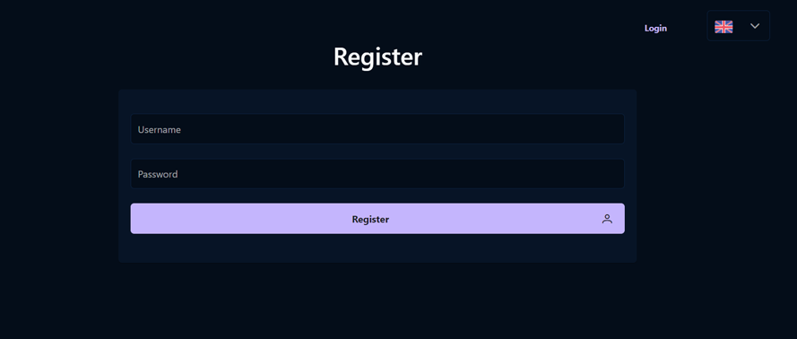
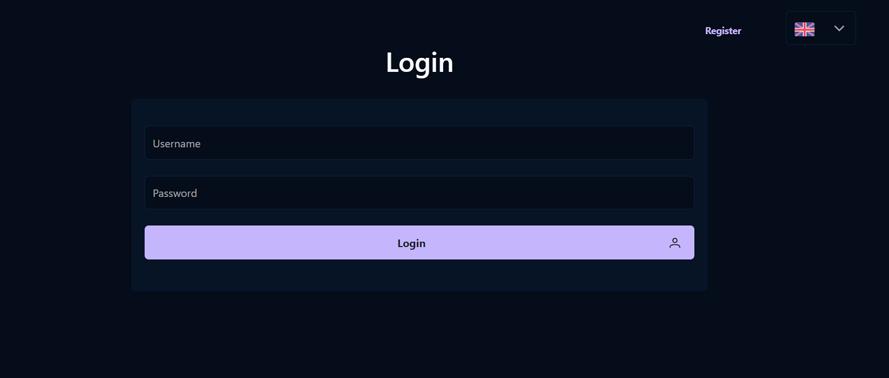
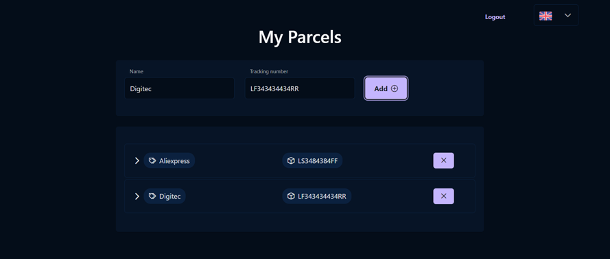
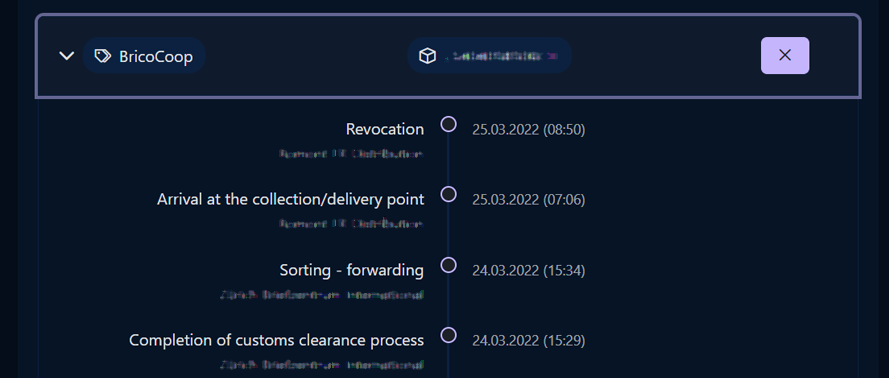
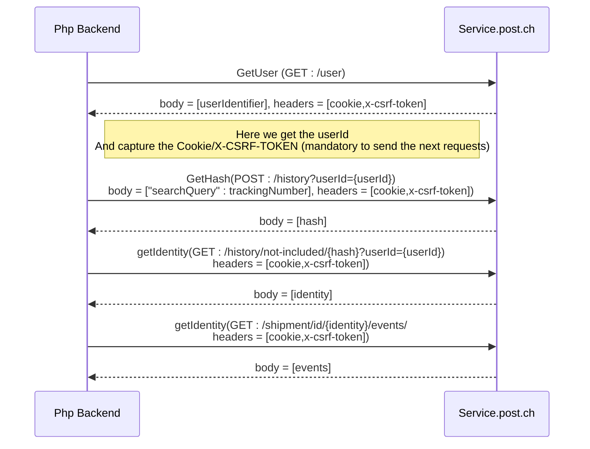

# CH Post Track
CH Post Track is an React app made to track your parcels
## Technologies
- [React] ([PrimeReact], [Bootstrap], [Axios])
- [Php]

## Features

- Login / Token login
- Register
- Add/Update/Remove parcels
- Show parcels status

# Installation

You will need a server that supports php and authorize the file_get_contents function

```sh
git clone "https://github.com/YungBricoCoop/ch-post-track.git"
# Transfer the "backend" folder to your server
# Edit the file "frontend/src/config/api.js" to point the links to your server
cd ch-post-track/frontend
npm i
npm start
```

# Examples

### Register

### Login

### Parcels

### Tracking


# Post.ch API Explanation 

To get the event list of a parcel you have to make several requests to the Post API. Since it is not possible from the frontend because of cores we will do it from the backend. however we will need to save the cookies/x-csrf-token to use them in requests




   [React]: <https://reactjs.org>
   [Bootstrap]: <https://react-bootstrap.github.io>
   [PrimeReact]: <https://www.primefaces.org/primereact>
   [Axios]: <https://axios-http.com/docs/intro>
   [Php]: <https://www.php.net>
   